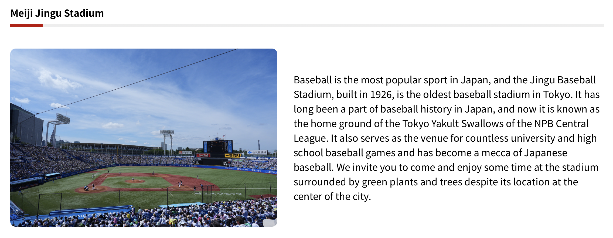

+++
date = '2026-02-23T20:36:44+08:00'
draft = false
title = 'No.014 新年之後'
tags = ["talk"]
categories = ["2026","talk"]
series = [] 
description = "新年新希望"
slug = ""
image = ""
+++
## 2026 農曆新年之後  
新年假期很快結束了，真正的一年終於開始，其實一年很快就過去了，今年還是該有一些目標才是，今天就想把今年想做的事情、希望完成的願望都拿出來聊聊

## 棒球
今年的棒球計畫大致上如下：
- 去神宮球場看球：今年是明治神宮球場 100 年，而新神宮球場計畫開始進入第二階段「拆除部分現有辦公建築，準備興建商業大樓」，現在正在寫相關的系列文章，希望今年球季可以去個兩趟。
- 去台南亞太球場看球：今年統一獅正式遷移到亞太球場，目前還沒去過希望今年上半季找個系列賽過去看幾場比賽，還好去年颱風前有去台南舊球場看球，算是對於舊球場最後的告別。
- 去台灣其他沒去過的小球場看球：目前去過的球場 大巨蛋、天母、新莊、桃園、洲際、斗六、台南舊球場、澄清湖，希望其他球場今年也有機會去看看。
- 暑假去看韓職：目前沒特別計畫，可能隨便找幾個球場去看看場內氣氛，優先選擇比較熱鬧的主場，目前也沒研究可能再找時間去看，因為韓職買票比較麻煩，可能要先計畫找代購和找好時間跟機票，不會額外加上旅遊大概就安排兩天兩場韓國速攻。
## 工作
今年的工作計畫大致上如下：
- 去年底檢討沒什麼搞頭的部分，會優先收尾，不要浪費注意力在不重要的地方。
- 新計畫會採取保守一點的方式，先進入相關行業試試水溫。
- 今年會新增 ai 部分的新計畫，但還沒有完整的想法，可能邊做邊找方向。
- 會有部分採取現金流戰術，不求賺錢但求擴大這部份營業額。
## 生活
因為去年去台南美術一館，剛好看到[「by POINTS 逐跡：讓未來遇見現在」](https://today.line.me/tw/v3/article/kENNwe0)這個計畫，他是把台灣重要而且可能毀損的古蹟，掃描建成數位檔，但目前相關的資訊少得可憐，可能要先深入去研究再開始出發，我想跟著這個計畫，優先去這些點實際拍拍照、寫寫相關文章，希望今年能逐步完成，這部份之後也要寫相關系列文章。
## 最後的最後
還是希望今年可以身體健康發大財，祝所有朋友也都心想事成、新的一年都順順利利快快樂樂。
